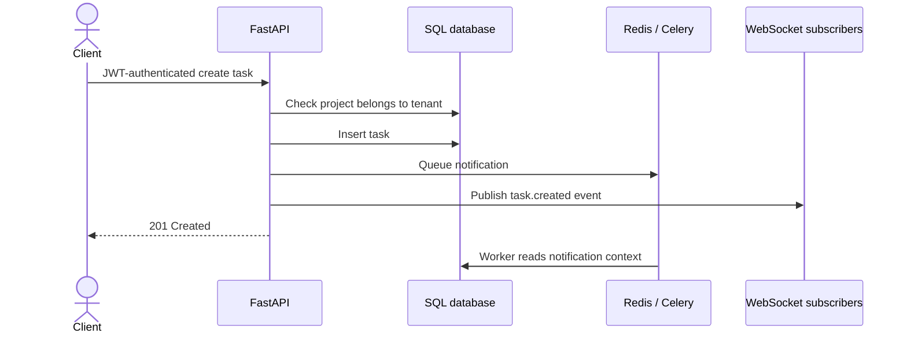
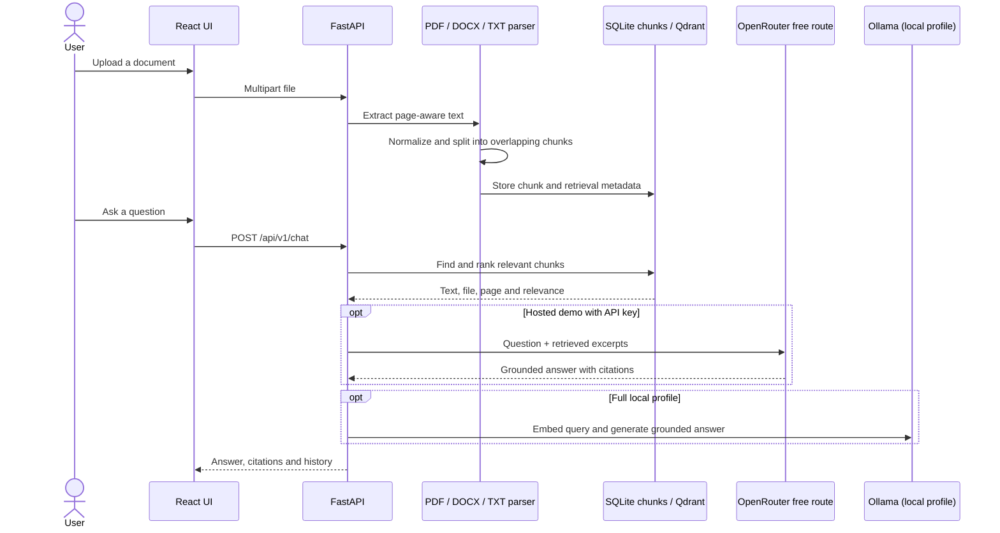

# Architecture and design notes

This portfolio contains two independent services. Pulseboard focuses on backend engineering; Knowledge Assistant demonstrates document ingestion and retrieval. The hosted profile deliberately trades persistence and model quality for a zero-cost demo. Local Compose keeps the richer architecture visible and runnable.

## Pulseboard API

### Request and event flow

### Isolation and authorization

Access tokens identify a user; the server loads the active user and takes the tenant identifier and role from the database. Project and task queries are scoped by that tenant. The task creation path checks both project ID and tenant ID before insertion, so a guessed foreign project ID is treated as not found. Owner-only project creation and webhooks use a role dependency.

### Webhook idempotency

The demo webhook signs a canonical JSON representation with HMAC-SHA256 and compares signatures with a constant-time comparison. A database unique constraint on `(tenant_id, idempotency_key)` guards duplicates across concurrent requests. The same logical request can then be retried without processing its event twice.

### Async work and realtime

In the full local profile, Redis is the Celery broker and carries tenant-scoped Pub/Sub events to WebSocket connections. The hosted profile performs the notification synchronously and uses in-process queues because a free single instance has no Redis or separate worker. In-memory messages are best-effort and disappear on restart. A transactional outbox would be the next step for durable event delivery.

### Operations

`/health/live` reports process liveness; `/health/ready` checks the configured database and Redis dependency. `/metrics` exposes request count and latency histograms. Docker Compose provides PostgreSQL, Redis, worker, Prometheus and provisioned Grafana dashboard for local exploration.

## Knowledge Assistant

### Ingestion and answer flow

The hosted profile tokenizes the question and chunk text, ranks up to three passages with cosine similarity, and sends the question plus relevant excerpts to the `openrouter/free` model route. The API key stays in the server environment; the original uploaded file is not sent to the model provider. Context is capped at about 6,000 characters, and the prompt asks the model to answer only from the excerpts, cite sources, and ignore instructions found inside document content. If no key is configured, the API returns an extractive answer instead. OpenRouter availability and free-model quotas can change.

The full profile embeds chunks with Ollama, stores vectors in Qdrant, retrieves nearby passages and asks the local model to answer only from those passages. Both hosted and local paths return filename/page/text metadata for cited sources. The API accepts PDF, DOCX and TXT, rejects other extensions and enforces a byte-size limit. Uploaded files are removed after indexing. The hosted demo stores extracted chunks and chat history in SQLite and seeds a small public guide so the first query works immediately.

## Why the hosted demo differs

Render Free instances can sleep and their container filesystem is ephemeral. The free Blueprint therefore runs two web services and no managed databases, persistent volumes, Redis, Celery workers, Qdrant or Ollama. SQLite keeps the demo self-contained. Knowledge Assistant uses lexical retrieval and can optionally generate answers through OpenRouter's free-model route; when model access is unavailable or no key is configured, it can fall back to extractive answers.

This profile validates the request flow and UI, but it is not a durable multi-user SaaS deployment. Knowledge Assistant has no user accounts or per-visitor document isolation, so its documents and chat history are shared in the demo. Data can reset and in-memory Pulseboard events are not durable. The full Compose profiles demonstrate the richer local integrations.

## Deliberate next steps before production

- Use managed PostgreSQL and persistent object storage; add tested migration/backup and restore procedures.
- Add tenant-aware accounts and authorization to Knowledge Assistant; apply per-user quotas and retention/deletion controls.
- Move uploads and indexing behind a durable job queue; validate file contents, scan files and cap decompressed document size.
- Use a transactional outbox for task and webhook events; add dead-letter handling and retry policies.
- Add rate limiting, audit logs, secret rotation, structured tracing and security review.
- Build retrieval evaluation fixtures for answer correctness, citation coverage and prompt-injection resistance.
- Pin frontend dependencies with a committed lockfile and run dependency/image vulnerability scans.

## Verification

GitHub Actions runs Pulseboard lint and tests, Knowledge Assistant tests, and the React production build on every push and pull request. The deployed health endpoints are `/health/ready`; API contracts are exposed through FastAPI's generated OpenAPI schema and Swagger UI.
