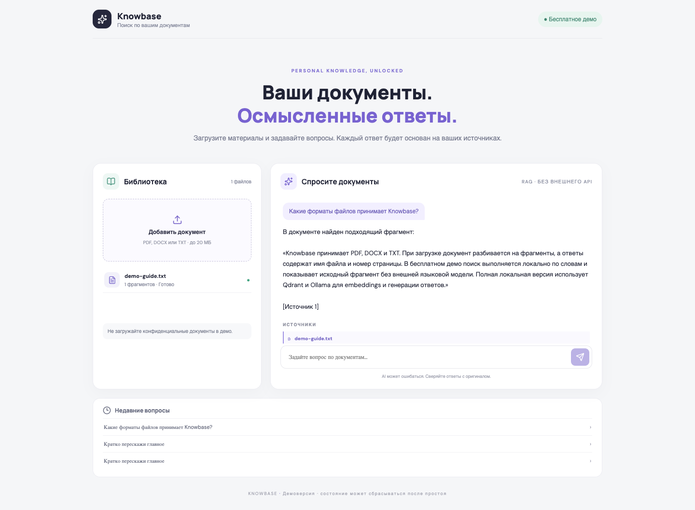
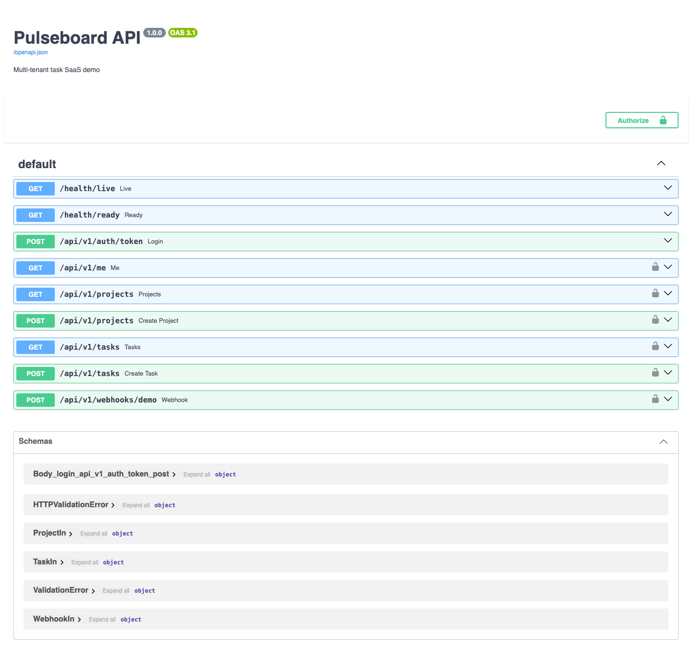
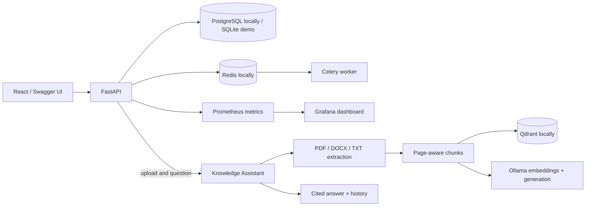

# Python Backend & Applied AI Portfolio

Two runnable portfolio projects covering multi-tenant API design and document-grounded AI. Both have a free hosted demo and a fuller local Docker Compose profile.

## Live demos

| Project | Demo | API reference |
|---|---|---|
| **Pulseboard API** — SaaS projects and tasks | [Open API](https://portfolio-pulseboard-demo.onrender.com) | [Swagger UI](https://portfolio-pulseboard-demo.onrender.com/docs) |
| **Knowledge Assistant** — document search with cited sources | [Open app](https://portfolio-knowledge-demo.onrender.com) | [Swagger UI](https://portfolio-knowledge-demo.onrender.com/docs) |

The hosted instances run on Render Free. They may sleep when idle and their SQLite data can reset. The cloud Knowledge Assistant uses extractive retrieval; the local profile adds Ollama generation and Qdrant vector search. See [deployment notes](./RENDER.md).

## Product previews

**Knowledge Assistant — answer grounded in the demo guide**



**Pulseboard — interactive OpenAPI documentation**



[Watch the 14-second product tour](./media/portfolio-demo.webm) · [Architecture and design decisions](./ARCHITECTURE.md)

## What each project demonstrates

### Pulseboard API

- FastAPI, async SQLAlchemy, PostgreSQL, Alembic and SQLite demo mode
- JWT authentication, role checks, tenant-scoped project and task access
- Celery task processing, Redis Pub/Sub and WebSocket events in the full profile
- Signed webhook handling with idempotency keys
- Prometheus metrics, health checks, Docker Compose, Grafana provisioning
- API docs and automated tests

### Knowledge Assistant

- PDF, DOCX and TXT extraction with page-aware chunking
- Qdrant vectors and Ollama embeddings/generation in the local profile
- Extractive, no-API retrieval for the hosted free demo
- Answers with source excerpts, page numbers and conversation history
- FastAPI, async SQLAlchemy, React UI, Docker Compose and automated tests

## Architecture at a glance



See [ARCHITECTURE.md](./ARCHITECTURE.md) for the request flows, key trade-offs and known demo limits.

## Run locally

Requirements: Docker Desktop with Compose.

```bash
cd pulseboard-api
cp .env.example .env
docker compose up --build
```

Pulseboard API: <http://localhost:8000/docs>
Prometheus: <http://localhost:9090> · Grafana: <http://localhost:3000>

```bash
cd ../knowledge-assistant
cp .env.example .env
docker compose up --build
```

Knowledge Assistant: <http://localhost:8001> · API docs: <http://localhost:8001/docs>

The first local run downloads the configured Ollama models. The free cloud profile does not require an AI API key.

## Engineering workflow

The root [GitHub Actions workflow](./.github/workflows/ci.yml) runs backend tests and lint, RAG tests and a frontend build on pushes and pull requests. Render deploys from `main`. Deployment configuration and free-tier limits are in [RENDER.md](./RENDER.md).

## Repository contents

- [Pulseboard API](./pulseboard-api/README.md)
- [Knowledge Assistant](./knowledge-assistant/README.md)
- [Architecture and trade-offs](./ARCHITECTURE.md)
- [Render deployment guide](./RENDER.md)
- [Free Render Blueprint](./render-free.yaml)

This is a portfolio demonstration, not a production service. The free hosted demos are intentionally small and disposable; each project README describes the security and operational work needed before real customer data is used.
